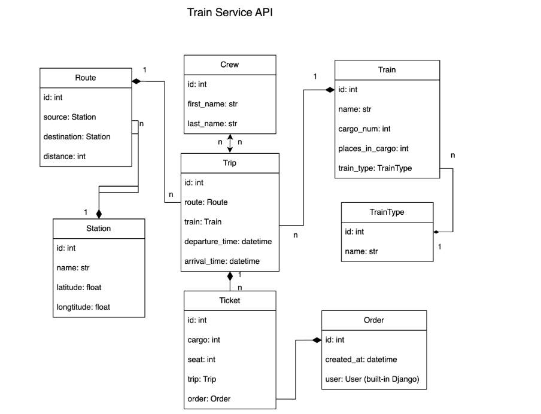
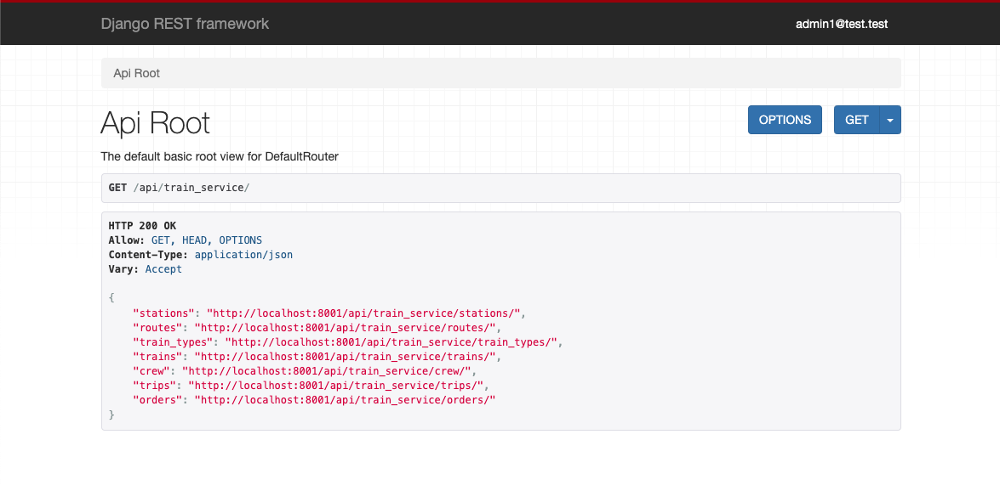

# Train Service API

DRF API that allows you to manage train schedules, routes, and bookings.

___

### Features 

* CRUD operations for stations, routes, train types, trains, crew, trips, and orders.
* Filtering and sorting of data.
* Authentication and authorization using JWT.
* Pagination for large datasets.
* API documentation using Swagger UI.

___

### Installation via GitHub

#### Prerequisites

* Python 3.11
* pip
* Virtual environment (recommended)
* PostgreSQL
#### Setup

1. Clone the repository:

   ```bash
   git clone https://github.com/rinarice/train-service-api/

2.  Create and activate a virtual environment:

    ```bash
    python -m venv venv
    source venv/bin/activate
    ```
3.  Install dependencies:

    ```bash
    pip install -r requirements.txt
    ```

4.  Create a `.env` file based on `.env.example` and fill in the required values.

5.  Apply database migrations:

    ```bash
    python manage.py makemigrations
    python manage.py migrate
    ```

6.  Load initial data (optional):

    ```bash
    python manage.py loaddata train_service_data.json
    ```

7.  Create a superuser account (or use the provided credentials: 
    `admin2@test.test` / `1qazcde3`):

    ```bash
    python manage.py createsuperuser
    ```

8.  Start the development server:

    ```bash
    python manage.py runserver
    ```

___

### Run with Docker

#### Prerequisites

* Docker
* Docker Compose

#### Setup

1.  Clone the repository (if you haven't already).

2.  Build and run the Docker containers:

    ```bash
    docker-compose build
    ```
    
    ```bash
    docker-compose up
    ```

#### Access
You can use the following credentials:

* Email: `admin2@test.test`
* Password: `1qazcde3`

___
### DB Structure



___

### Home page


